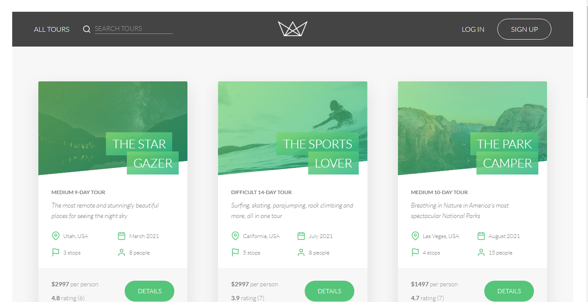

# NATOURS WEB APPLICATION

> BOOKING TOUR WEBSITE

---

### Table of Contents

- [Description](#description)
- [Main features](#main-features)
- [Technologies](#technologies)
- [Demo](#demo)
- [Author Info](#author-info)
<!-- - [License](#license) -->

---

## Description

Welcome to "Natours". This is my Project-based learning i have built using Node.js, Express, and MongoDB along with ES6+. Through this project I have learned many new skills as well as improved my current skills

---

## Main features

- CRUD Tour, Booking, Review, User; Authentication/Authorization, etc (Complete API).
- Login/Logout user, Booking tour, Show tours (include all tours, tour detail, booked tours), Edit profile, Change password, Payment, Send emails, upload image files (Features).

---

## Technologies

- HTML, CSS, JavaScript.
- Node JS (Express, EJS), NPM, MongoDB (Mongoose).
- RESTful API (includes filters, sorts, pagination).
- Using the MVC (Model-View-Controller) architecture.
- Authentication with JWT.
- Security: encryption, sanitization, rate limiting, etc.
- Credit card payments with Stripe
- Sending emails with Mailtrap
- Deploying application with Heroku
- Managing Source Code with Git/Github
- Checking API with Postman

---

## Demo

https://natourmie.herokuapp.com/

---

<!--
## License

MIT License

Copyright (c) [2022] [Huynh Thanh Trung]

Permission is hereby granted, free of charge, to any person obtaining a copy
of this software and associated documentation files (the "Software"), to deal
in the Software without restriction, including without limitation the rights
to use, copy, modify, merge, publish, distribute, sublicense, and/or sell
copies of the Software, and to permit persons to whom the Software is
furnished to do so, subject to the following conditions:

The above copyright notice and this permission notice shall be included in all
copies or substantial portions of the Software.

THE SOFTWARE IS PROVIDED "AS IS", WITHOUT WARRANTY OF ANY KIND, EXPRESS OR
IMPLIED, INCLUDING BUT NOT LIMITED TO THE WARRANTIES OF MERCHANTABILITY,
FITNESS FOR A PARTICULAR PURPOSE AND NONINFRINGEMENT. IN NO EVENT SHALL THE
AUTHORS OR COPYRIGHT HOLDERS BE LIABLE FOR ANY CLAIM, DAMAGES OR OTHER
LIABILITY, WHETHER IN AN ACTION OF CONTRACT, TORT OR OTHERWISE, ARISING FROM,
OUT OF OR IN CONNECTION WITH THE SOFTWARE OR THE USE OR OTHER DEALINGS IN THE
SOFTWARE.

--- -->

## Author Info

- LinkedIn - [Trung Huynh](https://www.linkedin.com/in/trung-hu%E1%BB%B3nh-7522b5213/)
- CV Online - [Huynh Thanh Trung](https://trung-git.github.io/cv-trung/)

(<a href="#top">back to top</a>)

